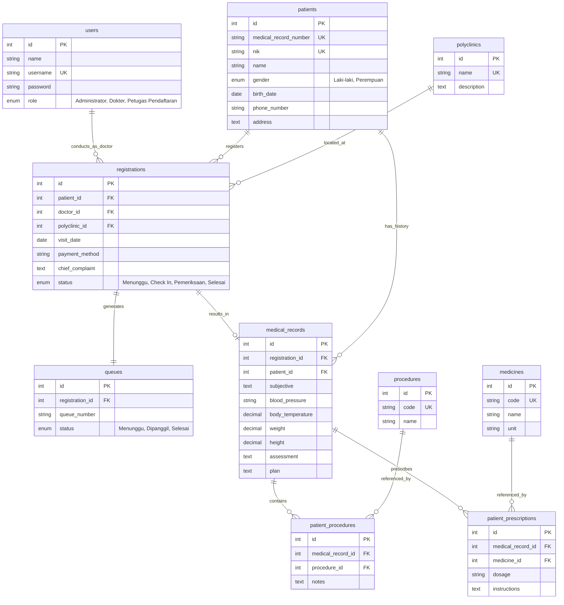

# Entity Relationship Diagram (ERD)
## Mini Clinic Information System (Nexa Clinic)

Berikut adalah diagram relasi entitas (ERD) dari database `db_nexa_clinic`.

```mermaid
erDiagram
    users ||--o{ registrations : "conducts_as_doctor"
    patients ||--o{ registrations : "registers"
    polyclinics ||--o{ registrations : "located_at"
    
    registrations ||--|| queues : "generates"
    registrations ||--o| medical_records : "results_in"
    patients ||--o{ medical_records : "has_history"
    
    medical_records ||--o{ patient_procedures : "contains"
    procedures ||--o{ patient_procedures : "referenced_by"
    
    medical_records ||--o{ patient_prescriptions : "prescribes"
    medicines ||--o{ patient_prescriptions : "referenced_by"

    users {
        int id PK
        string name
        string username UK
        string password
        enum role "Administrator, Dokter, Petugas Pendaftaran"
    }

    patients {
        int id PK
        string medical_record_number UK
        string nik UK
        string name
        enum gender "Laki-laki, Perempuan"
        date birth_date
        string phone_number
        text address
    }

    polyclinics {
        int id PK
        string name UK
        text description
    }

    medicines {
        int id PK
        string code UK
        string name
        string unit
    }

    procedures {
        int id PK
        string code UK
        string name
    }

    registrations {
        int id PK
        int patient_id FK
        int doctor_id FK
        int polyclinic_id FK
        date visit_date
        string payment_method
        text chief_complaint
        enum status "Menunggu, Check In, Pemeriksaan, Selesai"
    }

    queues {
        int id PK
        int registration_id FK
        string queue_number
        enum status "Menunggu, Dipanggil, Selesai"
    }

    medical_records {
        int id PK
        int registration_id FK
        int patient_id FK
        text subjective
        string blood_pressure
        decimal body_temperature
        decimal weight
        decimal height
        text assessment
        text plan
    }

    patient_procedures {
        int id PK
        int medical_record_id FK
        int procedure_id FK
        text notes
    }

    patient_prescriptions {
        int id PK
        int medical_record_id FK
        int medicine_id FK
        string dosage
        text instructions
    }
```
